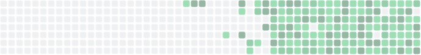

dynamically updated heatmap in an svg

<picture>
  <source media="(prefers-color-scheme: dark)" srcset="./result_dark.svg">
  <source media="(prefers-color-scheme: light)" srcset="./result_light.svg">
  
</picture>

### code

```md
<picture>
  <source media="(prefers-color-scheme: dark)" srcset="./result_dark.svg">
  <source media="(prefers-color-scheme: light)" srcset="./result_light.svg">
  
</picture>
```

### example repo

my [leetcode](https://github.com/jish2/leetcode) repo using a github action to update the heatmap daily
